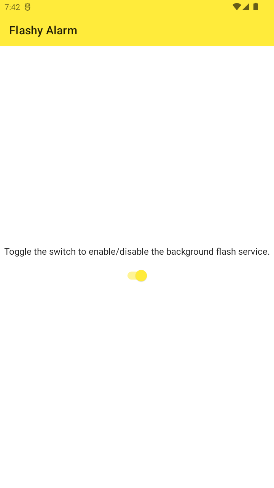
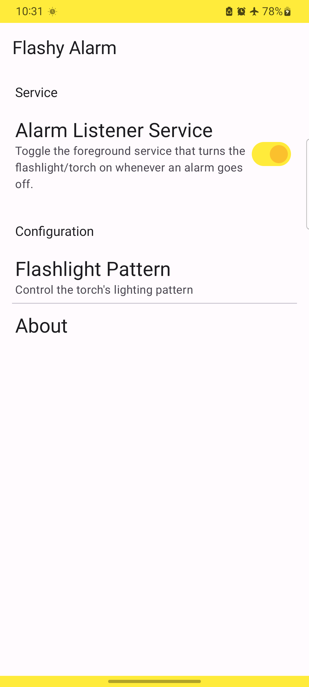
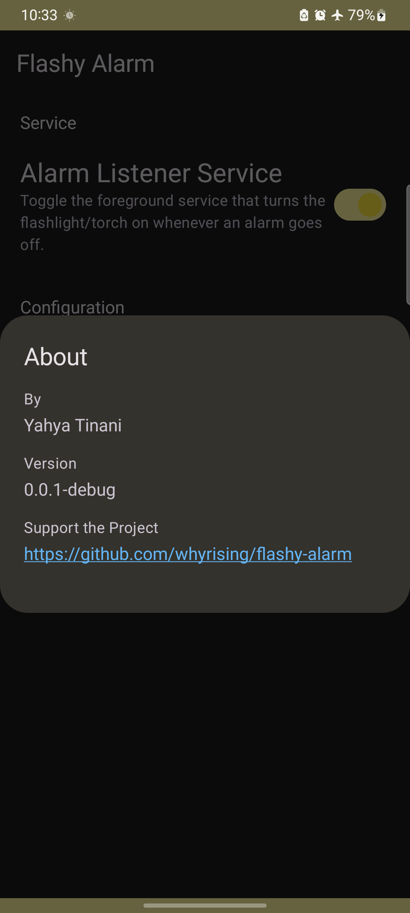
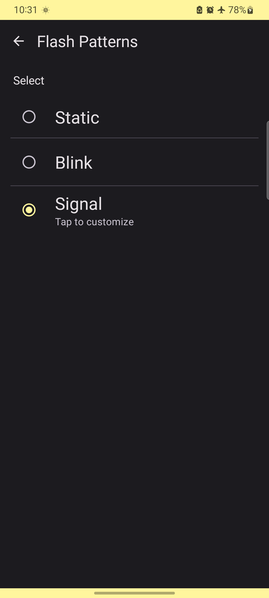
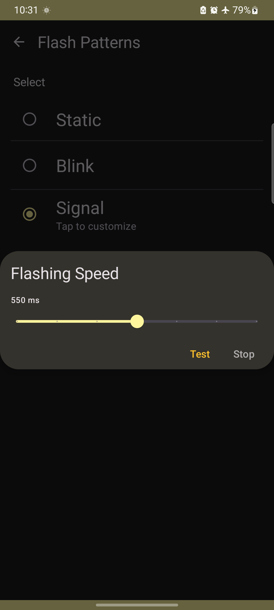

Flashy Alarm
======

Awaken fully with this app that automatically triggers your phone's
flashlight/torch when your alarm goes off during early morning darkness.

## Downloads:

## Screenshots:

    