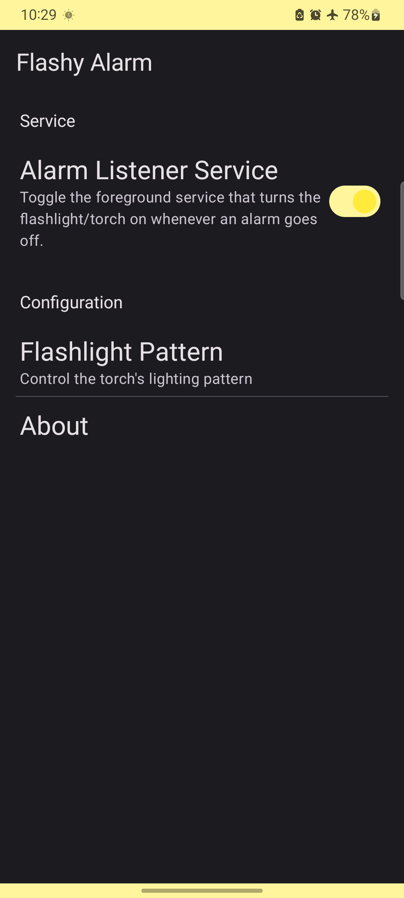

Flashy Alarm
======

You may want your phone's flashlight to get turned on automatically when your
alarm rings in early dark mornings to help your body fully wake up. This app
does just that.

## Downloads:

* Todo: release on Play Store

## Screenshots:

   
